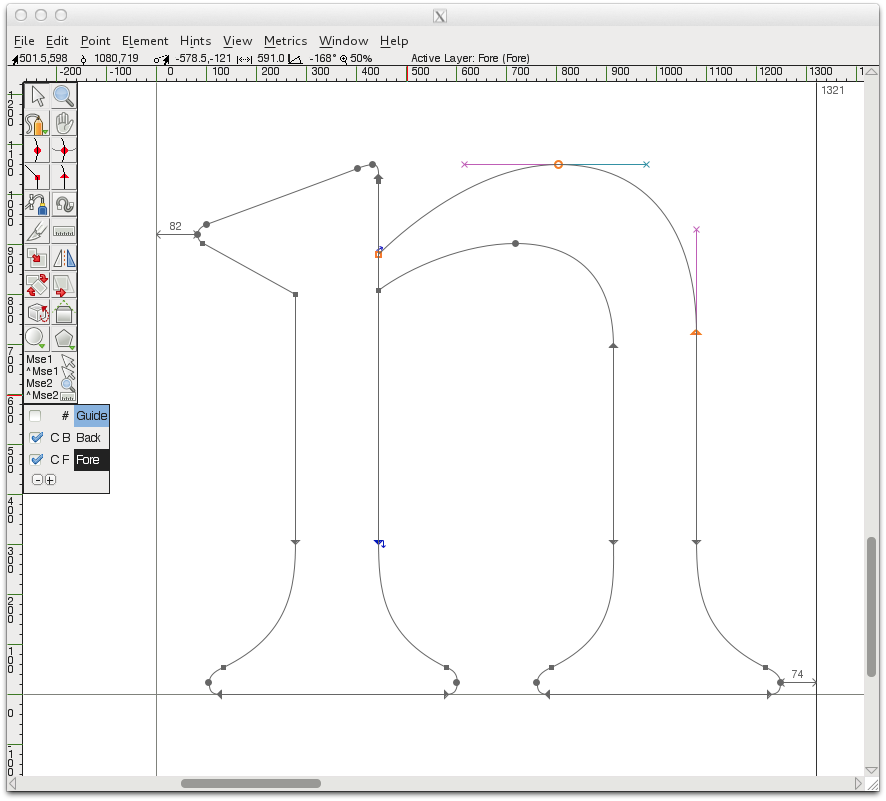
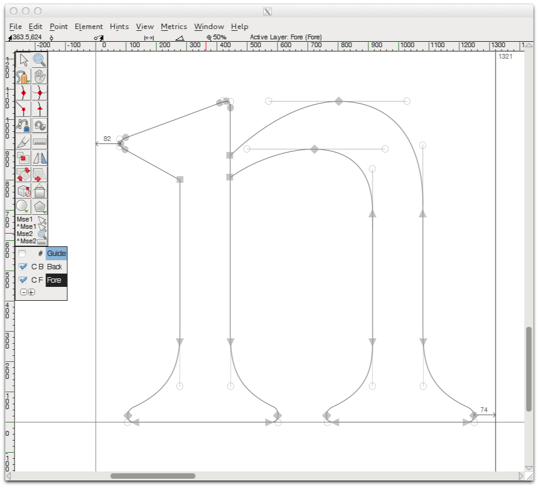
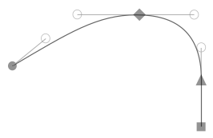
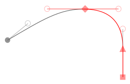
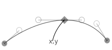
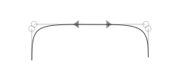
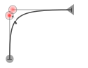
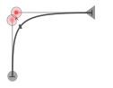

<h4>Points, curves, and handles</h4>

Points, curves and handles are at present (above) too small and and 'uneasy' for efficient viewing, differentiating, grabbing, moving, and editing.

Suggested improvement (below) would be to enlarge the forms, but also to decrease their color saturation. This would make the forms large enough to be functional, but not so 'bold' or 'dominant' in color, so as to become uneasy to view or overly distracting from the glyph curves.

Points should be opaque so as to aid identification of multiple points when grouped closely together.

<h4>Basic components</h4>

(above) Details showing basic components. Curve points are round, HV points are diamonds, tangent points are triangular (arrow) shaped, and corner points are square.

Bezier handles consist of 60% opaque lines terminating in outlined circles with no fill colour. This allow easier identification of handles when grouped close to other components. The end of the bezier handle centred inside the handle circle denotes the x,y potion of each handle terminal.

<h4>Differentiating selected components</h4>

Selected points, curves and handles should be more clearly differentiated from non selected. See use of red curves, points and handles (below).

<h4>Adding precision</h4>

To help provide precession information on point location the different components have been designed to be both large enough to enhance accurate identification and easy handling, but also contain elements that can show precise points locations.

Below we see that the precise location (x,y) of bezier handles, and of bezier points. Note the black arrows are for showing the point and handle locus, they are not part of the GUI.

<h4>Easing complexities</h4>

The classic FontForge GUI tended towards keeping points and handles small, presumably to lessen 'crowding' of elements. However experience of using that interface with type design students is that the elements are so small that they can be overly difficult to see, difficult to differentiate between elements and difficult to grab, manipulate and move. 

A solution could be to offer a dual-functional aspect of these elements. For example with the bezier handles (see below), precise location is provided by the central locus point (the terminal of the line in side the ring) yet the size of the ring provides a large enough object to see identify visually accurately and manipulate with ease.

 The same principle applies to points (see below). The grabbing area of the object is provided by the outer element, and the precise location of the point is provided by the line at the centre of the point intersecting with the handle line.

<h4>Easing the effects of crowding #1</h4>

The opaque nature of handles and points allows visual differentiation between closely position points. See the examples below.

<h4>Easing the effects of crowding #2</h4>

Large sized points and handles could cause difficulties when they overlap, and their size means their is more room for overlap. However the dual-functional aspect of the elements means this is also not an issue.

In the examples below we see that a handle becomes active to move when 2 variables are met; (a) the cursor is inside a handle radius, and (b) the locus is closer than any neighbouring locus.

So in the top example below the cursor is closest to the handle denoted by the red circle at it's locus. In the lower example the cursor is closest to the locus of the neighbouring handle.

